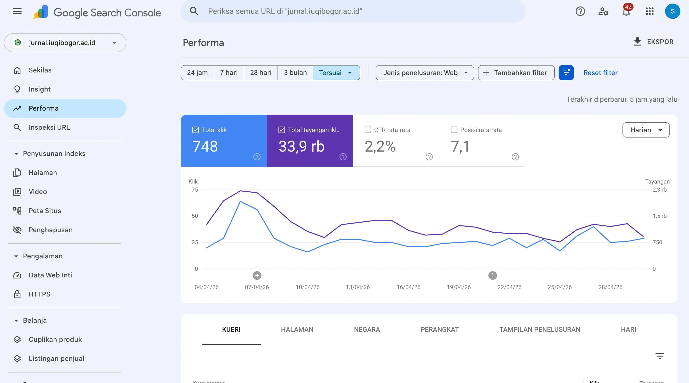
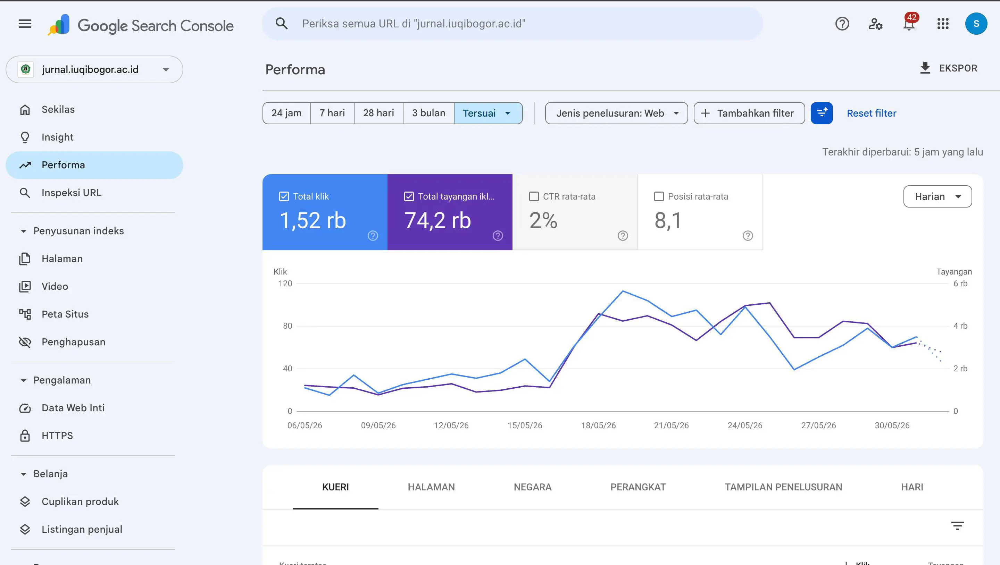

## Sebelum: Artikel sulit ditemukan, impresi stagnan

Jurnal ilmiah IUQI sudah memiliki konten berkualitas — tapi tidak dioptimasi untuk mesin pencari. Dampaknya:

- **Impresi rendah** — Hanya 34.000 impresi dalam 3 bulan. Artikel tidak muncul di halaman pertama Google Scholar.
- **Metadata tidak lengkap** — Tidak ada Dublin Core, OAI-PMH tidak terkonfigurasi. Google kesulitan memahami struktur artikel.
- **Kecepatan halaman buruk** — Waktu muat 4-8 detik. Google memprioritaskan situs yang cepat.
- **Tidak ada sitemap** — Crawler Google tidak bisa menemukan semua halaman jurnal secara efisien.

## Solusi: Fondasi SEO teknis yang solid

Motekarindo menerapkan optimasi SEO teknis menyeluruh:

- **Metadata Dublin Core** — Setiap artikel dilengkapi metadata author, title, abstract, date, dan identifier. Google Scholar bisa membaca dan mengindeks artikel dengan akurat.
- **OAI-PMH** — Protokol standar untuk harvesting metadata. Jurnal IUQI kini kompatibel dengan agregator dan repositori akademik global.
- **Sitemap XML** — Semua halaman jurnal — homepage, issue, artikel — terdaftar di sitemap. Crawler Google bisa menemukan konten baru lebih cepat.
- **Optimasi kecepatan** — Kompresi, caching, dan optimasi gambar. Waktu muat turun dari 4-8 detik ke <1.5 detik. User experience lebih baik, Google memberi peringkat lebih tinggi.
- **Struktur heading semantik** — H1, H2, H3 ditata sesuai hierarki konten. Google memahami struktur halaman dengan lebih baik.
- **Schema.org markup** — Artikel ilmiah diberi markup `ScholarlyArticle`. Rich snippets di hasil pencarian Google.

## Hasil

| Metrik | Sebelum | Sesudah |
|--------|---------|---------|
| Impresi | 34.000 (3 bulan) | 74.000 (1 bulan) |
| Kenaikan impresi | — | 2,2x lipat |
| Kecepatan halaman | 4–8 detik | <1.5 detik |
| Metadata Dublin Core | Tidak ada | Lengkap |
| OAI-PMH | Tidak terkonfigurasi | Aktif |

## FAQ

> [!tip]+ **Apakah optimasi SEO ini permanen?**
> Fondasi teknis yang kami bangun — metadata, sitemap, OAI-PMH, struktur heading — bersifat permanen dan tidak perlu diulang. Konten artikel baru akan otomatis mengikuti standar yang sama. Kami serahkan dokumentasi lengkap agar tim Anda bisa melanjutkan pengelolaan.

> [!tip]- **Berapa lama hasil SEO mulai terlihat?**
> Google butuh waktu untuk re-crawl dan re-index. Dalam kasus IUQI, kenaikan impresi mulai terlihat dalam 2-3 minggu setelah optimasi. Hasil penuh biasanya tercapai dalam 1-2 bulan.

> [!tip]- **Apakah optimasi ini cukup untuk terindeks SINTA?**
> Fondasi teknis adalah syarat wajib — tapi tidak cukup sendiri. Indeks SINTA juga mempertimbangkan kualitas artikel, sitasi, dan kepatuhan administratif. Kami bantu siapkan semua persyaratan teknis: sitemap, metadata Dublin Core, OAI-PMH, dan template sesuai standar Arjuna. Sisanya tergantung pada kualitas konten jurnal Anda.
