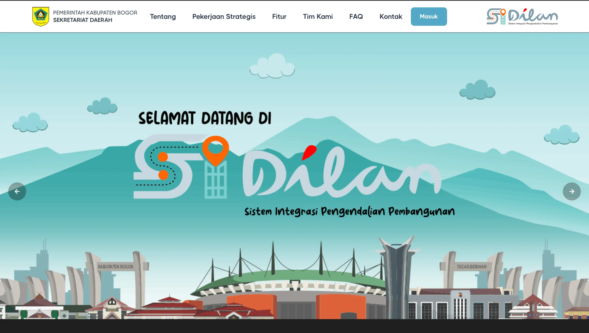

## Contoh gambar di body

Gambar di body markdown pakai path relatif dari file `.md` ini ke `src/assets/images/produk/`:



Format: `../../assets/images/produk/nama-file.webp`

## Contoh gambar di frontmatter

Gambar hero dari frontmatter pakai key `image.file` — cukup nama file saja:

```yaml
image:
  file: "erp-dashboard.webp"
  alt: "Dashboard ERP Percetakan Digital"
```
